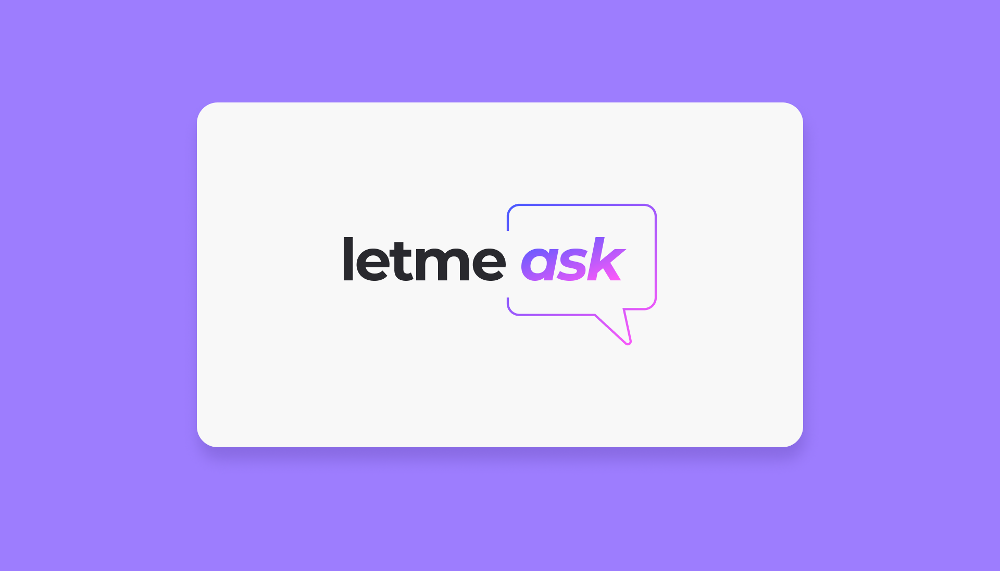
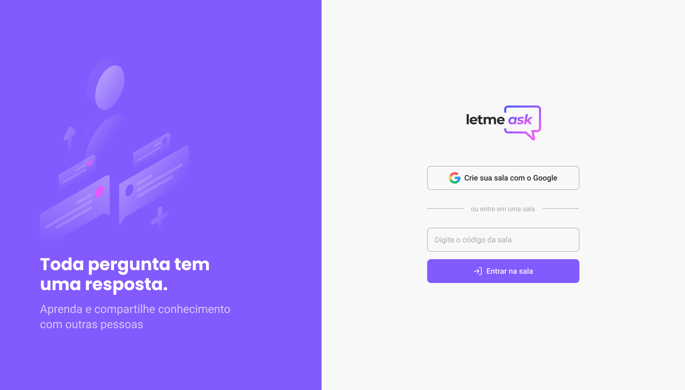

<p align="center">
  

  

  <a href="https://www.twitter.com/tgmarinho/">
    
  </a>
  
  <a href="https://github.com/tgmarinho/README-ecoleta/commits/master">
    
  </a>
    
   
   <a href="https://github.com/tgmarinho/README-ecoleta/stargazers">
    
  </a>

  <a href="https://rocketseat.com.br">
    
  </a>
  
  <a href="https://blog.rocketseat.com.br/">
    
    </a>
  
 
</p>
<h1 align="center">
    
</h1>

<h4 align="center"> 
	🚧  Letmeask 💭 Em andamento 🚀 🚧
</h4>

<p align="center">
 <a href="#-sobre-o-projeto">Sobre</a> •
 <a href="#-funcionalidades">Funcionalidades</a> •
 <a href="#-layout">Layout</a> • 
 <a href="#-como-executar-o-projeto">Como executar</a> • 
 <a href="#-tecnologias">Tecnologias</a> • 
 <a href="#-autor">Autor</a> • 
 <a href="#user-content--licença">Licença</a>
</p>


## 💻 Sobre o projeto

💭 Letmeask - é uma forma de você dono de live poder abrir salas para seus usuários poderem tirar duvidas.


Projeto desenvolvido durante a **NLW - Next Level Week** oferecida pela [Rocketseat](https://blog.rocketseat.com.br/primeira-next-level-week/).
O NLW é uma experiência online com muito conteúdo prático, desafios e hacks onde o conteúdo fica disponível durante uma semana.

---

## ⚙️ Funcionalidades

...
---

## 🎨 Layout

O layout da aplicação está disponível no Figma:

<a href="https://www.figma.com/file/u0BQK8rCf2KgzcukdRRCWh/Letmeask">
  
</a>


### Web

<p align="center" style="display: flex; align-items: flex-start; justify-content: center;">
  

</p>

---

## 🚀 Como executar o projeto
### Pré-requisitos

Antes de começar, você vai precisar ter instalado em sua máquina as seguintes ferramentas:
[Git](https://git-scm.com), [Node.js](https://nodejs.org/en/). 
Além disto é bom ter um editor para trabalhar com o código como [VSCode](https://code.visualstudio.com/)

#### 🧭 Rodando a aplicação web (Frontend)

```bash

# Clone este repositório
$ git clone git@github.com:MarconWillian/letmeask.git

# Acesse a pasta do projeto no seu terminal/cmd
$ cd letmeask

# Instale as dependências
$ yarn install
# ou npm install

# Execute a aplicação em modo de desenvolvimento
$ yarn start
# ou npm run start

# A aplicação será aberta na porta:3000 - acesse http://localhost:3000

```

---

## 🛠 Tecnologias

As seguintes ferramentas foram usadas na construção do projeto:

#### **Website**  ([React](https://reactjs.org/)  +  [TypeScript](https://www.typescriptlang.org/))

-   **[React Router Dom](https://github.com/ReactTraining/react-router/tree/master/packages/react-router-dom)**

> Veja o arquivo  [package.json](./package.json)

#### [](https://github.com/tgmarinho/Ecoleta#utilit%C3%A1rios)**Utilitários**

-   Protótipo:  **[Figma](https://www.figma.com/)**  →  **[Protótipo (Letmeask)](https://www.figma.com/file/u0BQK8rCf2KgzcukdRRCWh/Letmeask)**
-   Editor:  **[Visual Studio Code](https://code.visualstudio.com/)**  → Extensions:  **[SQLite](https://marketplace.visualstudio.com/items?itemName=alexcvzz.vscode-sqlite)**
-   Markdown:  **[StackEdit](https://stackedit.io/)**,  **[Markdown Emoji](https://gist.github.com/rxaviers/7360908)**
-   Commit Conventional:  **[Commitlint](https://github.com/conventional-changelog/commitlint)**


---

## 💪 Como contribuir para o projeto

1. Faça um **fork** do projeto.
2. Crie uma nova branch com as suas alterações: `git checkout -b my-feature`
3. Salve as alterações e crie uma mensagem de commit contando o que você fez: `git commit -m "feature: My new feature"`
4. Envie as suas alterações: `git push origin my-feature`

---

## 🦸 Autor

<a href="https://marconwillian.dev/">
 
 <br />
 <sub><b>Marcon Willian</b></sub></a> <a href="https://marconwillian.dev/" title="Marcon Willian">🚀</a>
 <br />

[](https://twitter.com/marconwillian) [](https://www.linkedin.com/in/marconwillian/) 

---

## 📝 Licença

Este projeto esta sobe a licença [MIT](./LICENSE).

Feito com ❤️ por Marcon Willian 👋🏽 [Entre em contato!](https://www.linkedin.com/in/marconwillian/)